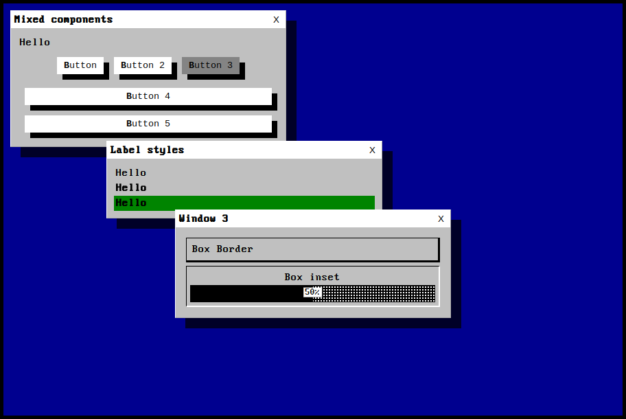

# Retro-UI

[](https://github.com/duck4i/retro-ui/actions/workflows/build.yml)

A modern React UI framework with distinctive retro vibes. Quirky and fugly by design.



## Retro-LLama demo 

To demonstrate usage of retro-ui components in practice we wanted to build something that combines both modern and antique, and hence the LLM AI driven project with a retro UI named **Retro Llama** was born.

You can try the [retro-llama](https://retro-llama.pages.dev/) here.

## Documentation 

This project provides the interactive documentation with code samples [here](https://retro-ui.pages.dev/).

## Usage

Install via npm:

```sh
npm install @duck4i/retro-ui
```

Then simply import the components you want and the necessary CSS style.

```js
import { App } from '@duck4i/retro-ui';
import '@duck4i/retro-ui/style.css'
```

## Repo instructions 

This repo is a Turborepo and Vite driven project for retro-ui react UI component framework and its accompanying retro-llama example.